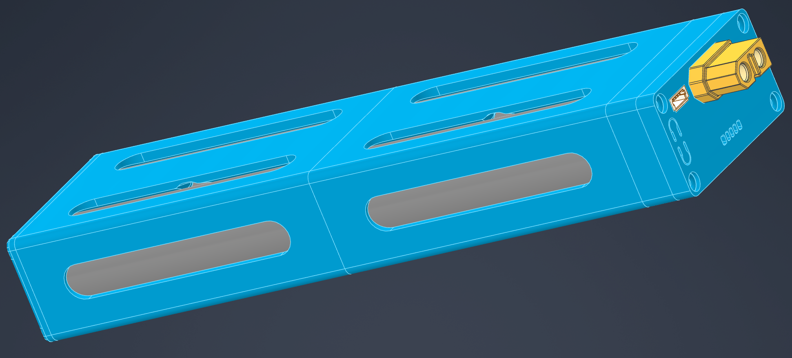

## 简介

### 项目概述

### 电源架构

<a href="https://greenhand520.github.io/quadhex_robot_base/docs/power_architecture.html">
</a>

## 硬件与结构

### PCB 设计

所有PCB（均使用 [JLCEDA Pro](https://pro.lceda.cn/editor/) 进行设计，对应工程文件位于 [`hardware`](hardware/) 目录下。

> 最新可以直接在线查看的 PCB 项目文件可以访问 [oshwhub 发布页面](https://oshwhub.com/) （等待所有PCB测试通过）。

### 3D 打印与机械结构

项目提供一个 3D 打印的 4S 21700 电池仓，可安装 BQ40Z50 保护板，建模参数适应 **PETG 材料** 和 **Bambu Lab A1** 打印机。其他材料和打印机未经测试，结构强度和尺寸无法保证。打印文件和物料清单（BOM）位于 [`mechanism`](mechanism/) 目录下：

```
mechanism/
├── stl/                    # 最新可打印 STL 文件
├── BOM.md                  # 物料清单（紧固件等）(TODO)
└── assembly_guide.md       # 装配指南(TODO)
```

4S 21700 电池仓 结构如下:



## 参与贡献

欢迎参与贡献！请阅读以下指南：

TODO

---

## 开源许可

本项目基于 **GNU 通用公共许可证 v3.0** 开源——详见 [LICENSE](LICENSE) 文件。

硬件设计（PCB 原理图、3D 模型）基于 **CERN 开放硬件许可 v2（CERN-OHL-P-2.0）** 开源。

---

## 致谢

排名不分先后

- [ROS2](https://docs.ros.org/) — 机器人操作系统 2
- [Xiaomi MiMo Token Plan](https://platform.xiaomimimo.com/token-plan) — 小米 MiMo 大模型 Token 订阅计划
- [CLion](https://www.jetbrains.com/clion/) — 为顺畅工作流程和高效开发而设计的跨平台 C/C++ 集成开发环境
- [MicroROS](https://micro.ros.org/) — 面向微控制器的 ROS2
- [JLCEDA](https://lceda.cn/) — PCB 设计工具（立创 EDA）
- [Bambu Lab](https://bambulab.com/) — 3D 打印平台

